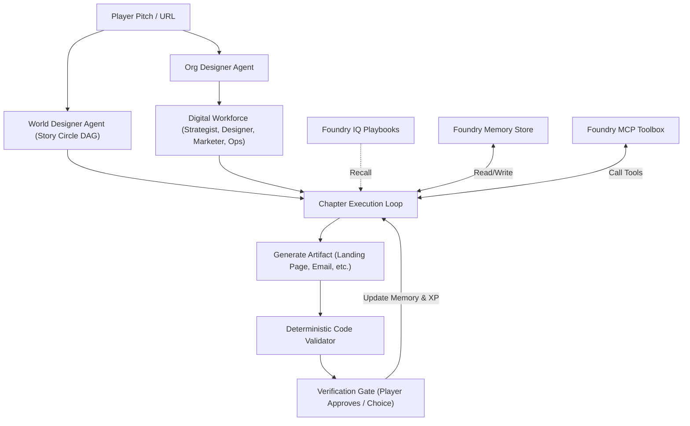

# Gamifying World Improvement

**A card-and-graph based, multi-agent world-improvement simulator powered by Microsoft Foundry reasoning agents.**

*Submitted for Microsoft Agents League · Battle #2 — Reasoning Agents.*

---

## The Concept: You Decide. The Agents Execute. The Human Verifies.

**Gamifying World Improvement** is a campaign-and-graph-based simulator where the player steps into the founder's chair. You pitch a world-improvement mission (e.g., solar microgrids, food-security logistics, clean water access) and guide an AI workforce through a roguelike deckbuilder experience to make it a reality.

* **Decomposition & Graphs (Story Circle):** A Microsoft Foundry-powered Master Narrator decomposes your pitch into a campaign graph (Story Circle) of chapters (e.g., *Discovery, Go-To-Market, Operations*).
* **Dynamic AI Workforce:** The Org Designer scans your pitch/profile and constructs a custom digital workforce of specialist worker cards (Strategist, Designer, Marketer, Ops) with specific mandates.
* **Recall & Memory Loop:** Workers recall playbook knowledge from **Foundry IQ** and read personalized memory profiles (procedural, user_profile, chat_summary) from the **Foundry Agent Service memory store**.
* **Actionable Tools:** Workers choose and invoke tools from an MCP-managed **Foundry Toolbox** to create real business artifacts.
* **Deterministic Verification Gates:** Nothing advances on vibes. Every artifact (landing pages, emails, positioning reports) is validated by code interpreter checks and must receive your human seal of approval before XP is awarded.

---

## Live Demo & How to Run

You can play the simulator immediately on your local machine. The project is designed to degrade gracefully: if no Azure credentials are provided, it falls back to a **local simulation mode** using mock agent outputs, allowing the game to remain fully playable and forkable.

### 1. Setup the Environment
```bash
# Clone the repository
git clone https://github.com/princepspolycap/agentsleague-afterbuild.git
cd agentsleague-afterbuild

# Create and activate virtual environment
python3 -m venv .venv
source .venv/bin/activate

# Install dependencies
pip install -r submission/requirements.txt
```

### 2. Run the Command-Line Quest Simulator (No Azure/Keys Required)
Run the end-to-end simulation of a campaign from the command line:
```bash
python3 submission/tools/run_quest_simulation.py --pitch "Green energy grids"
```

### 3. Run the Story-View UI Server
To play with the full graphical narration, audio cues, and the interactive verification gate:
```bash
# Start the FastAPI server
python3 submission/tools/server.py
```
Open your browser and navigate to `http://localhost:8070`.

### 4. Enable Live Microsoft Foundry Mode
1. Copy the example configuration:
   ```bash
   cp submission/.env.example submission/.env
   ```
2. Open `submission/.env` and fill in your Azure AI Foundry credentials, project endpoints, search indices, and deployment names.
3. Restart `server.py` to run live reasoning agents, real Foundry IQ lookups, and Azure neural voice synthesis.

---

## Core Architecture: How It All Connects



* Read the detailed technical narrative in [how_it_all_connects.md](submission/docs/how_it_all_connects.md)
* Read the game mechanics documentation in [game_design.md](submission/docs/game_design.md)

---

## Microsoft Agents League Rubric Alignment

| Rubric Dimension | Weight | Submission Proof Points |
|---|---:|---|
| **Accuracy & Relevance** | 20% | Maps the spec's Game Master and character agent pattern onto a multi-agent campaign loop. Runs live on the Microsoft Agent Framework (MAF). |
| **Reasoning & Multi-Step** | 20% | Real-time chapter decomposition, tool choosing, and reasoning token counts displayed on-screen. |
| **Reliability & Safety** | 20% | Human-in-the-loop verification gates, deterministic validator scoring, and full offline simulation fallback. |
| **Creativity & Originality** | 15% | The world-improvement campaign premise, model-designed teams, and agent memory as an active game mechanic. |
| **UX & Presentation** | 15% | Narrated story view, visual card layouts, live reasoning theater, and audio narration. |

See the complete evaluation checklist in [rubric_mapping.md](submission/docs/rubric_mapping.md).

---

## Repository Structure

* [submission/](submission/) — Core implementation folder:
  * [agents/](submission/agents/) — Foundry and local agent definitions.
  * [tools/](submission/tools/) — Server, quest simulator, and validators.
  * [state/](submission/state/) — Replay log, memory store, and state management.
  * [ui/](submission/ui/) — HTML/JS game assets and layout.
  * [docs/](submission/docs/) — Technical specification documents.
* [starter-kits/](starter-kits/) — Upstream Microsoft reference materials (untouched).
* [DISCLAIMER.md](DISCLAIMER.md) / [CODE_OF_CONDUCT.md](CODE_OF_CONDUCT.md) — Official event policies.
