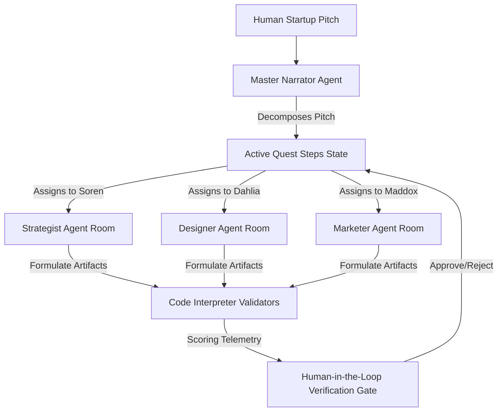

# Building AI Agents with Microsoft Foundry: A Progressive Game Master Journey
**Author:** AI Quest Architect
**Published:** May 2026

## Introduction
At the upcoming **Microsoft Agents League · Battle #2**, reasoning agents are taking center stage. To showcase the sheer reliability, reasoning depth, and creativity of the Microsoft Foundry model ecosystem, we built **"Your Company Is the Dungeon"**—a side-scrolling, multi-agent reasoning RPG using Phaser 3 and FastAPI. This blog tracks our thoughts, findings, and technical learnings using Microsoft Foundry resources.

---

## 1. Grounding Our Arch with Microsoft Foundry Resources
During design, we incorporated several blueprints and resources:
1. **[Microsoft Foundry lab Guide](https://techcommunity.microsoft.com/blog/azuredevcommunityblog/building-ai-agents-with-microsoft-foundry-a-progressive-lab-from-hello-world-to-/4521792)**: Taught us the core progression from single "Hello World" prompt invocations to complex multi-agent orchestration, structured JSON states, and deterministic validators.
2. **[Microsoft Reactor Workshop Series](https://developer.microsoft.com/en-us/reactor/series/S-1658/)**: Provided the template pattern of using a central **"Game Master" / Master Narrator** agent to decompose natural language prompts recursively.
3. **[Educator Developer Workspace](https://techcommunity.microsoft.com/category/educationsector/blog/educatordeveloperblog)**: Highlighted strategies for embedding safety checks directly into agent tooling so that reasoning steps do not go out of bounds.

---

## 2. Our Architecture: The Roleplay Storytelling Flow
The platform converts abstract business objectives into physical "rooms" inside an office dungeon.

---

## 3. Key Accomplishments & Technical Milestones
We synthesized these research hubs into an end-to-end local visual engine:
- **State Serialization**: Leveraging robust Pydantic schemas keeping track of XP, level badges, and the dynamic narrative sequence.
- **FastAPI Core (`tools/server.py`)**: Powering local execution gates, agent generation loops, and telemetry results.
- **Phaser 3 Side-Scroller Frontend (`ui/game.js`)**: Realizing immersive character warrooms (Blueprint Room, UX Lab, and Outreach Core), visual particle animations, and smart proximity-dialogue popups.

---

## Conclusion: Share Your Learnings
By separating reasoning (Microsoft Foundry), deterministic checks (Python Code Interpreter), and rendering (Phaser 3), we've created a reliable, fully forkable setup matching advanced AI practices. Let’s keep building!
